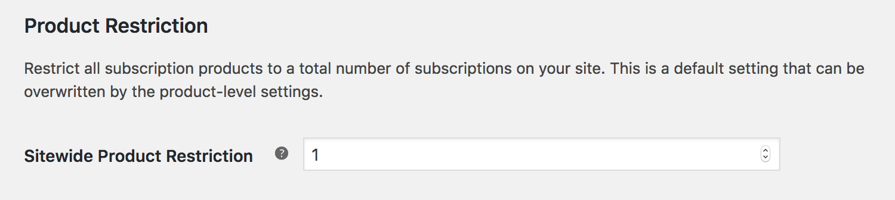
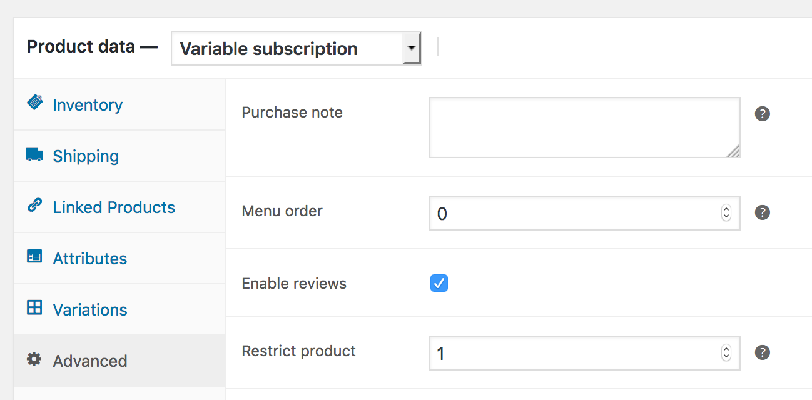
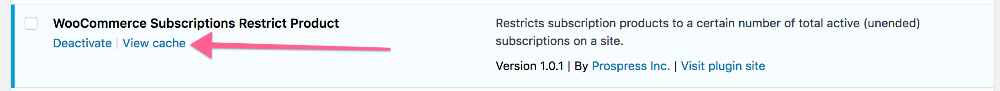

# WooCommerce Subscriptions Restrict Product

Restricts subscription products to a certain number of total active (unended) subscriptions on a site.

Use case: store owner wants products and subscriptions to have a one-to-one relationship, i.e. each product should only be subscribed to once. For example, subscription product is a child to be sponsored, and only one subscriber should be sponsoring that child at a time.

This plugin creates and maintains a list of products that have unended subscriptions associated with them, then makes these products unpurchasable from front end to make sure that the subscription product can only be subscribed to a certain number of times. It doesn't change ability to check out with product, so that customer can pay for failed order through cart, and manual renewals are unaffected.

Note: This plugin is designed to work independently of the WooCommerce inventory system, and so inventory should be disabled for all subscription products, or you may have problems with customers not being able to pay for failed renewal orders manually.

## Installation

To install:

1. Download the latest version of the plugin [here](https://github.com/Prospress/woocommerce-subscriptions-restrict-product/archive/master.zip)
1. Go to **Plugins > Add New > Upload** administration screen on your WordPress site
1. Select the ZIP file you just downloaded
1. Click **Install Now**
1. Click **Activate**

## How-to

### Set Product Restriction

There are two ways to set a product restriction, either _storewide_ or on a _product level_. Setting a _product level_ restriction is more specific and will override the _storewide default_. If you set either to '0' or leave them empty, they are considered not set.

#### Storewide Restriction

You can set a default storewide restriction which will apply to all subscription products by going to *WooCommerce -> settings -> Subscriptions (tab) -> Product Restriction*

#### Product-level Restriction

You can also set a product restriction for a specific product by editing the product, and clicking on the 'Advanced Options' tab in the Product Data metabox. This will set the product restriction on a product level for simple and variable subscription products. That means that the restriction applies no matter which variation of a variable product is subscribed to.

- To activate the product-level restriction, you must click the "Activate product-level restriction" checkbox.
- If "Activate product-level restriction" checkbox is checked, but the restriction quantity is blank, then no restriction will be applied to this product, even if there is a systemwide default set elsewhere.

### Renewals and Switching

Renewals and Switches are taken into account when checking if a purchase should be restricted.

#### Renewals
_Automatic renewals_ are not restricted at all, and should process normally. Similarly, _manual renewals_ will still allow the product to be purchased/renewed through the cart.

#### Subscription Switching
Switching is accounted for when checking restrictions. When switching between simple subscription products, the checks still occur as normal. When switching between variations of the same product, the restrictions are ignored, allowing the switch to occur.

### Visibility
When displaying a product in the catalog or archive pages, this plugin will hide the product if it is restricted, _and_ if the 'Out of stock visibility' option is checked in WooCommerce settings -> products -> inventory tab.

### Warning Messages

There is currently no way to customize the warning message presented when a restriction is encountered. Additionally, when product variations are deemed not purchasable, the default WooCommerce alert box is triggered, which is not descriptive of _why_.

For this reason, we recommend you add in some descriptive text to your product description indicating that it is restricted, and why.

### Additional Notes

- Restrictions don't apply retroactively, only to future purchases. In other words, any given purchase is checked against the current restriction and current number of active site-wide subscriptions. No already-existing subscriptions will be cancelled or suspended if you change the restriction number. Future purchases _will_ be checked against subscriptions that existed before the plugin was activated, however.
- Deactivating the plugin will stop the restriction checks, and will delete the cache. However, the restriction option values (set in the WooCommerce settings tab or product options) will stay in place in case you choose to reactivate the plugin in the future.

### Troubleshooting

To view the current cache for troubleshooting purposes, navigate to the 'plugins' page and click the 'view cache' option.

### Updates

To keep the plugin up-to-date, use the [GitHub Updater](https://github.com/afragen/github-updater).

## Reporting Issues

If you find a problem or would like to request this plugin be extended, please [open a new Issue](https://github.com/Prospress/woocommerce-subscriptions-restrict-product/issues/new).

---

	

